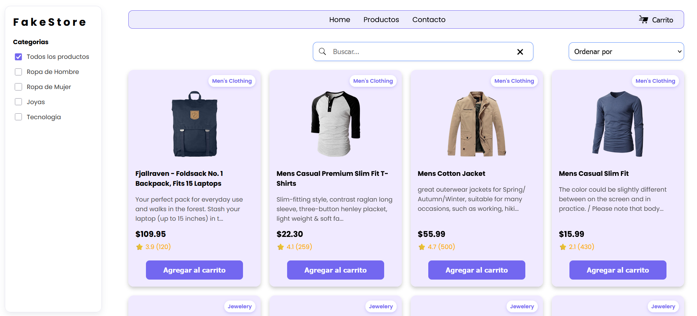
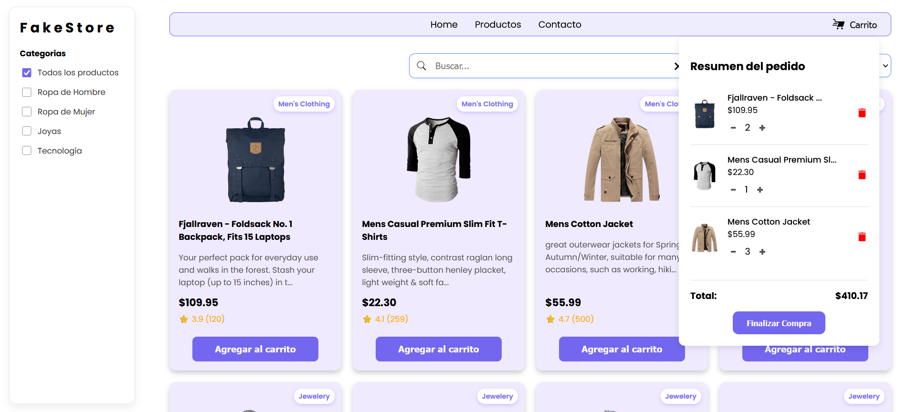

# 🛍️ FakeStore

FakeStore es una aplicación web de comercio electrónico ficticio, desarrollada como práctica de **desarrollo web** utilizando **HTML5, CSS3 y JavaScript**.  
El proyecto simula una tienda en línea donde los usuarios pueden explorar productos, aplicar filtros, gestionar un carrito de compras y disfrutar de una experiencia **interactiva, modular y responsive**.

---

## 🚀 Funcionalidad Principal

La aplicación permite al usuario:
- Visualizar un listado de productos obtenidos desde una **API**.
- Filtrar productos por **categoría**, **precio**, **orden alfabético** y **búsqueda por texto**.
- Agregar y eliminar productos del **carrito de compras**.
- Almacenar el carrito de compras en el **LocalStorage**, garantizando persistencia aunque se recargue la página.

---

## ✨ Características

- 🛒 Carrito de compras interactivo.  
- 🔎 Filtros avanzados (categoría, precio, búsqueda por texto, ordenamiento ascendente/descendente).  
- 📱 Diseño **responsive** adaptable a dispositivos móviles y escritorio.  
- ⚡ Desarrollo modular con JavaScript.  
- 🌐 Consumo de datos desde una **API** externa.  

---

## 📂 Estructura del Proyecto

```
FakeStore
├── Analisis/        # Contiene el análisis y decisiones de diseño
│   └── analisis.md
├── assets/          # Recursos (imágenes, íconos, PDFs)
├── modules/         # Lógica y módulos JS
│   ├── api/         # Conexión con la API
│   ├── config/      # URL de la API
│   ├── ui/          # Manejo de interfaz y componentes
│   └── main.js      # Punto de entrada principal
├── styles/          # Estilos CSS
├── index.html       # Página principal
```

---

## 🛠️ Tecnologías Utilizadas

- **HTML5**
- **CSS3**
- **JavaScript**
- **LocalStorage** para persistencia de datos  

---

## 📸 Capturas de Pantalla


- Vista de productos  
- Carrito de compras  
- Filtros aplicados  




---

## ▶️ Instalación y Uso

**Opción 1: Abrir directamente**

1. Clonar este repositorio:
    ```bash
    https://github.com/JhoanS5/Proyecto_FakeStore_DiazJhoan_BuitragoDaniel.git
    ```
2. Abrir el archivo `index.html` en el navegador.
    - Doble clic en el archivo, o
    - Arrastrar y soltar en una ventana del navegador.

**Opción 2: Usar Live Server (recomendado)**

1. Abrir la carpeta del proyecto en Visual Studio Code.
2. Instalar la extensión [Live Server](https://marketplace.visualstudio.com/items?itemName=ritwickdey.LiveServer).
    - Ir a la pestaña de extensiones (`Ctrl+Shift+X`).
    - Buscar "Live Server" e instalarla.
3. Hacer clic derecho en `index.html` → **Open with Live Server**.
4. El proyecto se abrirá en [http://localhost:5500](http://localhost:5500) automáticamente.

---

## 👨‍💻 Autor


- [Jhoan Diaz](https://github.com/JhoanS5)
- [Daniel Buitrago](https://github.com/DanielBuitrago29)

---
## 📄 Licencia

Este proyecto es de uso académico y para aprendizaje.

---
## 📌 Notas

Este proyecto fue creado desde cero, partiendo de bocetos y wireframes diseñados por el equipo, con un enfoque en modularidad, buenas prácticas y experiencia de usuario.